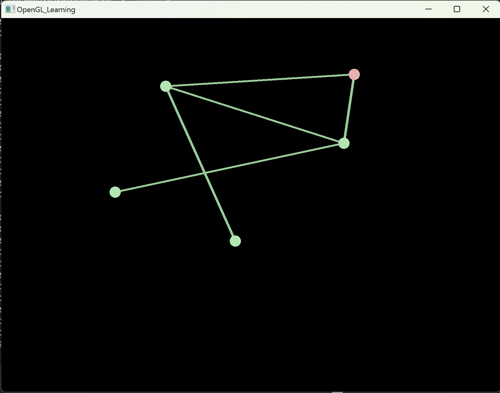
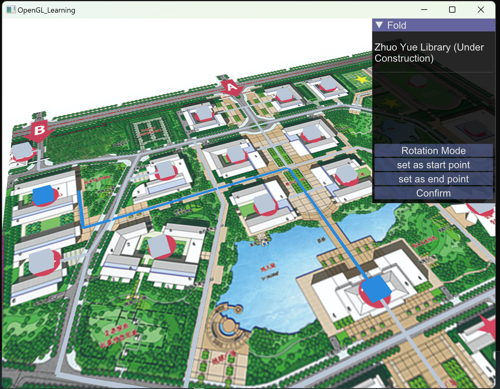

# practice4_Graph

## 4.1 无向图小程序
### 操作指南
- `单击空白处`：添加节点
- `点击两个节点`：插入边
- `双击某个节点`：随机进行深度优先/广度优先遍历

## 4.2 最小生成树
没花什么时间，修改“input.txt”可以编辑数据，但是只支持7*7的矩阵

## 4.3 校园导航
### 操作指南
- 点击选中节点，可以在操作页面将它设为起点或终点，点击确认开始导航
- 可以设置切换移动模式或旋转模式，多角度观察

## 后记

时隔一年，很难说自己这段特殊的经历到底是不是一件好事。

其实课程结束之后就没有再碰过cpp。一年的时间自学了WebGIS、前后端开发、网络服务器什么的也略微了解，然后独立做了比较完整的GIS项目。接触了各种语言、各种框架，囫囵吞枣的花里胡哨的，同时还要兼顾自己的专业课。确实很辛苦，但回忆起来也非常骄傲。多热血的青春啊。

这次实习选择使用opengl其实也是临时起意，没有上过计算机图形学，全部都是现学现做（大概或许如果做的不够好的话请多包涵！），然后发现还挺有意思的。

感觉自己并不算有天赋的人，至少在当时上课的时候没有意识到一些应该意识到的事情。或许如果不是这样一个一年过去了解了其他一些语言之后，让我再重新审视这门语言的契机，我大概永远都不会意识到了。

所以应该还是庆幸的吧。